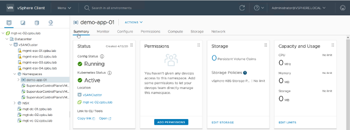
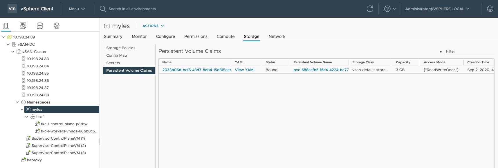
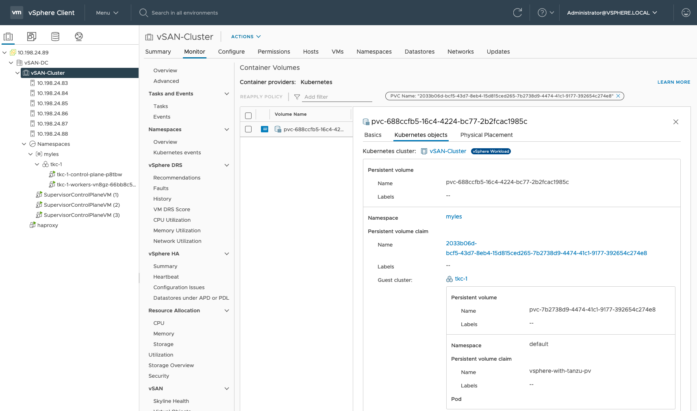
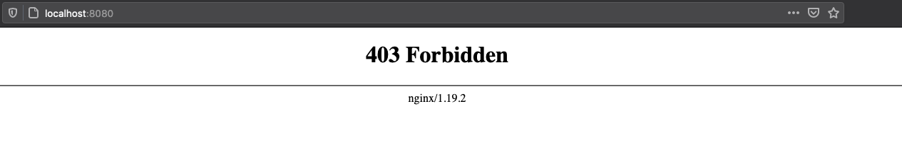
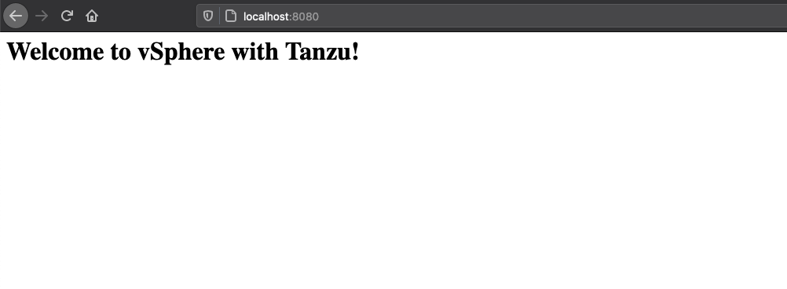

# vSphere with Tanzu Quick Start Demo

## Log in to Supervisor cluster

Kubernetes and containers are developer technologies, as such almost all of the tooling assumes either Linux or macos as an operating system, that includes things like exporting environment variables and other shell commands - this guide is written to follow those guidelines and it is recommended you use a Linux VM or otherwise to ease troubleshooting. If you are running Windows you will need to adjust the commands to their Windows equivalents.

### Download the tools

To interact with vSphere with Tanzu you will need to download `kubectl` and the associated vSphere CLI plugin for `kubectl`, both of these are available at the Namespace level in vCenter.

Navigate to the Namespace and look in the `Status` column for "`Link to CLI Tools`", Click `Open` and follow the instructions on the web page you are taken to to install the `kubectl` CLI and associated plugin.



### Log in using `kubectl`

To interact with our new vSphere with Tanzu supervisor cluster and begin provisioning resources we need to login first. Below we export the environment variables `SC_IP` (Supervisor Cluster IP) and `NAMESPACE` (your vSphere with Tanzu namespace name) with the information specific to our environment. You will be prompted to put in your password after running this command. It is important to ensure the user has been given RBAC permissions (`Namespaces -> Namespace -> Permissions -> Add`) on the vSphere with Tanzu namespace for you to be allowed to log in.

```sh
export SC_IP=10.198.52.128
export NAMESPACE=myles
kubectl vsphere login --server=https://$SC_IP --vsphere-username administrator@vsphere.local --insecure-skip-tls-verify
```

### Set kubectl context to be the supervisor cluster

After successfully logging in, we now need to tell the Kubernetes command line that it should use the newly downloaded context (you can think of a context as a keychain to access a specific K8s cluster). Setting the context tells `kubectl` that any commands we issue through it from that point on will be sent to that specific K8s cluster.

As you can see from the below, vSphere with Tanzu contexts are named after the Namespace created in vCenter, so a direct copy and paste will work as long as you've exported the environment variables in the last step.

```sh
kubectl config use-context $NAMESPACE
```

#### Troubleshooting

If the above command doesn't connect you to the correct context, that may be because you already have a context in your `~/.kube/config` file with the same name as the Namespace.

In this case, vSphere with Tanzu will have created a context in the `Namespace-Supervisor Cluster IP` pattern. As such, the below command should connect you to the correct context:

```sh
kubectl config use-context $NAMESPACE-$SC_IP
```

## Deploy TKG Service cluster

Next up, we need a Kubernetes cluster to deploy some workloads to - when you deploy vSphere with Tanzu it gains you a control plane that acts like Kubernetes to allow you to request and create resources in a K8s-like fashion. E.g. you ask the Supervisor cluster for a Kubernetes cluster and it will build one for you using TKG Service.

So let's deploy a sample Tanzu Kubernetes Cluster with one control plane node and one worker node.

```sh
kubectl apply -f https://raw.githubusercontent.com/vsphere-tmm/vsphere-with-tanzu-quick-start/master/manifests/tkc.yaml
```

You can look at the `tkc.yaml` manifest file to see exactly what we're requesting from the Supervisor Cluster if you want.

*Note:* You can change the version number to match the distribution version you wish to deploy.
Run kubectl get tkr to get a list of compatible versions.

Now, this will take some time, it needs to build out some VMs, spin them up and install the requested packages and set up K8s - so either go grab a coffee, or you can watch the deployment in one of two ways.

*Note:* The deployment should take around 30 minutes

### Watching the deployment in vCenter

Navigate to your Namespace in the vCenter UI and you should see an object `tkc-1` pop up under your namespace, this is your TKG Service K8s cluster. You can watch the two VMs spin up.

### Watching the deployment via `kubectl`

The primary way to watch your deployment via `kubectl` is to `describe` the Tanzu Kubernetes Cluster deployment with the following command:

```sh
kubectl describe tkc
```

This will give all kinds of status information about the components that make up the TKG cluster.

#### Troubleshooting

Another way to monitor or troubleshoot the deployment is using the `watch` flag (`-w`) against all VMs created by vSphere with Tanzu on the underlying vSphere infrastructure:

```sh
$ kubectl get virtualmachine -w
NAME                                   AGE
tkc-1-control-plane-p8tbw              30d
tkc-1-workers-vn8gz-66bb8c554d-hnhgm   30d
```

You can gather more info on a given VM instance by changing the `get` to a `describe` and adding the name of one of the instances from the above output:

```sh
kubectl describe virtualmachine tkc-1-control-plane-p8tbw
```

## Login to TKG Service cluster

Once your TKG Service K8s cluster is deployed, we need to tell `kubectl` to use it as the target, instead of the supervisor cluster.

This will allow us to deploy workloads and such to the TKG cluster that was just deployed.

If you have been following these step by step instructions up to this point, you can directly copy and paste this command in and it will log you in to the TKG cluster:

```sh
kubectl vsphere login --server=$SC_IP --tanzu-kubernetes-cluster-name tkc-1 --tanzu-kubernetes-cluster-namespace $NAMESPACE --vsphere-username administrator@vsphere.local --insecure-skip-tls-verify
```

### Use the TKG cluster context

As before, this will download the available contexts to your local machine, and you then need to tell `kubectl` to target the TKG cluster context to allow you to deploy to it.

```sh
kubectl config use-context tkc-1
```

We're now up and running with a new TKG K8s cluster and can have som fun deploying workloads to it!

## Create an allow all Pod Security Policy

This shouldn't be done in production, but for a quick start, this will bind all authenticated users to run any type of container:

```sh
kubectl create clusterrolebinding default-tkg-admin-privileged-binding --clusterrole=psp:vmware-system-privileged --group=system:authenticated
```

## Deploy a workload

### Deploy busybox and get a shell

The simplest possible proof of concept is to run a `busybox` container on the K8s cluster and then get a shell in it, this uses no fancy features of K8s and will just show you that it can run generic containers.

The following command will run the `busybox` container on your TKG cluster (because that's the context we told `kubectl` to use) and to get a shell inside the container, additionally, once we exit the container, it will be stopped.

```sh
kubectl run -i --tty busybox --image=quay.io/quay/busybox --restart=Never -- sh
```

#### Test out busybox

You can run generic linux commands once you get your shell, so i've listed a few, but feel free to poke around.

```sh
ping google.com
traceroute -n google.com
exit
```

The container will automatically shut down after you `exit` because it is invoked via `kubectl run` which tells K8s to run the pod until it is exited.

#### Verify that the pod is there, but stopped

```sh
kubectl get pods
```

#### Delete the pod

```sh
kubectl delete pod busybox
```

### Deploy a pod from a manifest

We are now going to deploy a pod using a Kubernetes manifest - these are written in yaml, you can find the ones we are using in the [`manifests`](./manifests) folder.

Let's deploy an application that needs storage and we will update the StorageClass provided with the cluster to be the default to make provisioning easier.

#### Viewing a StorageClass

When you set up vSphere with Tanzu, you added storage to your install, this will have been automatically added to your TKG service cluster for you.

You can get its name by running:

```sh
$ kubectl get storageclass

NAME                          PROVISIONER              RECLAIMPOLICY   VOLUMEBINDINGMODE   ALLOWVOLUMEEXPANSION   AGE
vsan-default-storage-policy   csi.vsphere.vmware.com   Delete          Immediate           true                   8d
```

If you used the `tkc.yaml` file in the `/manifests` folder here, the default StorageClass is already set for you (by the last three lines).

#### Claim a PersistentVolume

Next up, let's create a PersistentVolume (PV) so we can store some data, to do this, you must create a PersistentVolumeClaim (PVC) - that is essentially asking Kubernetes "please give me X amount of storage".

I have created a manifest called [pvc.yaml](./manifests/pvc.yaml) that requests 3GB of storage from Kubernetes (and therefore, from the underlying storage system - in this case, vSphere).

Let's deploy that manifest and see the volume get created:

```sh
kubectl apply -f https://raw.githubusercontent.com/vsphere-tmm/vsphere-with-tanzu-quick-start/master/manifests/pvc.yaml
```

#### Query the volume status

Let's find out what the states are of the PersistentVolumeClaim (PVC), and the PersistentVolume (PV) it requested:

```sh
$ kubectl get pv,pvc
NAME                                                        CAPACITY   ACCESS MODES   RECLAIM POLICY   STATUS   CLAIM                           STORAGECLASS                  REASON   AGE
persistentvolume/pvc-7b2738d9-4474-41c1-9177-392654c274e8   3Gi        RWO            Delete           Bound    default/vsphere-with-tanzu-pv   vsan-default-storage-policy            54s

NAME                                          STATUS   VOLUME                                     CAPACITY   ACCESS MODES   STORAGECLASS                  AGE
persistentvolumeclaim/vsphere-with-tanzu-pv   Bound    pvc-7b2738d9-4474-41c1-9177-392654c274e8   3Gi        RWO            vsan-default-storage-policy   64s
```

*Note: You can continually watch a resource by appending `-w` to the command, e.g:*

```sh
kubectl get pv -w
```

##### Verify the PersistentVolume in vCenter

In your vCenter, after you kicked off the above command the integration exposes all of the information about the Kubernetes volume to vSphere with Tanzu.

Log into your VC and navigate to your `namespace -> Storage -> PersistentVolumeClaims` and you should see the PVC in the UI as below:



If you click on the `Name` you will be brought to the new Cloud Native Storage UI which will give you even more detail on the volume - more on that in this [YouTube video](https://www.youtube.com/watch?v=CZUBuWCgeDQ).



#### Attach the volume to a Pod

Pods are Kubernetes-speak for a container or a group of containers (you can have more than one container in a Pod in some cases).

So let's create a Pod that uses the PersistentVolume we just created.

Again, just like last time - I created a Pod manifest that consumes the PVC we just deployed. This is a simple name mapping (note: `vsphere-with-tanzu-pv` is used in both) as can be seen in the snippet below:

```yaml
pod.yaml
...
spec:
  volumes:
    - name: my-pod-storage
      persistentVolumeClaim:
        claimName: vsphere-with-tanzu-pv
...
```

```yaml
pvc.yaml
...
metadata:
  name: vsphere-with-tanzu-pv
...
```

```sh
kubectl apply -f https://raw.githubusercontent.com/vsphere-tmm/vsphere-with-tanzu-quick-start/master/manifests/pod.yaml
```

The above creates the mapping between the Pod and the PVC, and now, we have an up and running NginX container with storage attached.

```sh
$ kubectl get po
NAME                     READY   STATUS    RESTARTS   AGE
vsphere-with-tanzu-pod   1/1     Running   0          2m52s
```

#### Accessing the Pod

If we access the pod now (below), we should get an `Error: 403` as we haven't added any content to the NginX web server yet.

The below command creates a tunnel, from your local machine on port `8080` to the pod inside the kubernetes cluster on port `80`, so when you access `localhost:8080` it gets tunnelled directly to the pod on port `80`.

```sh
kubectl port-forward vsphere-with-tanzu-pod 8080:80
```

Open [http://localhost:8080](http://localhost:8080) in your web browser and you should see the below:



So let's fix that - let's add a web page to it. I pre-created a (very) simple web page to allow you to copy it into the container easily. Let's get into the container and pull the web page into it's PersistentVolume:

```sh
kubectl exec -it vsphere-with-tanzu-pod -- bash
```

As in the busybox container from the earlier example, you now have a shell in the NginX container, let's change directory to where NginX serves content from and pull the web page in:

```bash
cd /usr/share/nginx/html
curl https://raw.githubusercontent.com/vsphere-tmm/vsphere-with-tanzu-quick-start/master/site/index.html -o index.html
exit
```

Now we can hit our site again by opening another `port-forward` connection to it:

```sh
kubectl port-forward vsphere-with-tanzu-pod 8080:80
```

Open [http://localhost:8080](http://localhost:8080) in your web browser and you should see the message:



### Use the built in Load Balancer in vSphere with Tanzu

Rather than connecting over the tunnel, as we have been up to now - you can use something called a Kubernetes `Service`, this allows the Pod to be accessible to either other Pods in the cluster in the case of the service type `ClusterIP`, or to the outside world, in the case of the service types `NodePort` and `LoadBalancer`.

For ease of demonstration (and frankly, what most people use in production) is a [`Service` with `Type: LoadBalancer`](https://kubernetes.io/docs/concepts/services-networking/service/#publishing-services-service-types). In vSphere with Tanzu, this will automatically allocate the service an IP from the Virtual IP range that was set when creating your vSphere with Tanzu deployment. It will use HAProxy to automatically route traffic from the IP address allocated, to the K8s cluster.

In the case of our service [svc.yaml](./manifests/svc.yaml) - it will expose port `80` on whatever load-balanced IP it is assigned by vSphere with Tanzu to port `80` on the container(s). Additionally, Kubernetes uses a `selector` of `app: nginx` to figure out what backend Pods it should load balance across, this same label can be seen in [pod.yaml](./manifests/pod.yaml) in the `metadata` section and is what creates the mapping from the `Service` to the `Pod`.

```sh
kubectl apply -f https://raw.githubusercontent.com/vsphere-tmm/vsphere-with-tanzu-quick-start/master/manifests/svc.yaml
```

The `Service` will spin up on the cluster, claim an IP and make it accessible to you. You can find out what IP it has been assigned by issuing the following command:

```sh
$ kubectl get services
NAME                TYPE           CLUSTER-IP      EXTERNAL-IP    PORT(S)      AGE
nginx-service       LoadBalancer   10.103.49.246   192.168.1.51   80:80/TCP    1h
```

Whatever is listed in the above `EXTERNAL-IP` column, you can then navigate to in your browser and receive the same web page as before - but this time over your corporate network, and it's fully fronted and load balanced by vSphere with Tanzu!
